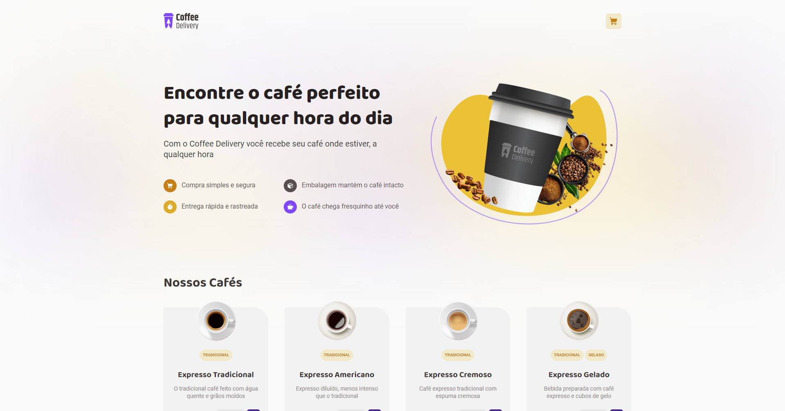
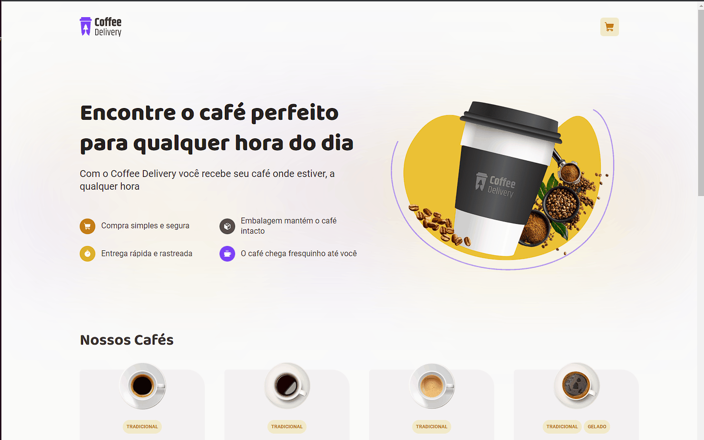
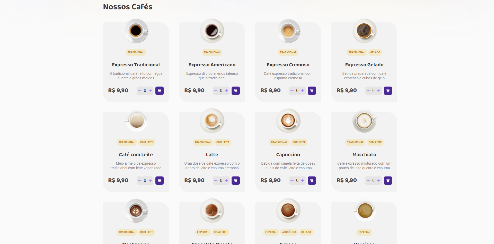
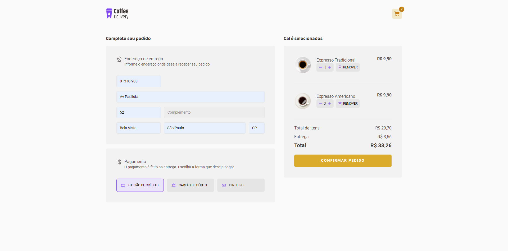
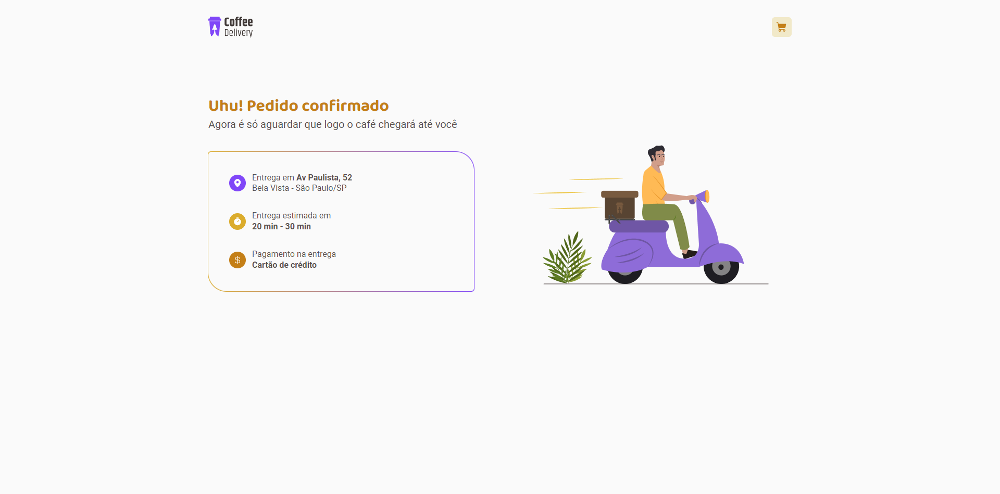

# README - Aplicação Coffee Shop

## Visão Geral

A aplicação Coffee Shop é uma aplicação em React com TypeScript que tem como objetivo servir como um projeto didático para praticar conceitos de Context API e useReducer. Ela não usa nenhum banco de dados e autenticação de usuário, sendo que os dados dos produtos são salvos no local storage do navegador.

Para estilização, foram utilizados styled-components e Radix UI para criar componentes acessíveis. O formulário de checkout utiliza o React Hook Forms.

## Recursos

A aplicação Coffee Shop inclui os seguintes recursos:

- Adição de itens ao carrinho com quantidade personalizada
- Remoção de itens do carrinho
- Checkout simples com informações básicas de entrega e método de pagamento
- Página de sucesso exibindo informações de entrega e estimativa de tempo

## Instalação

Para executar a aplicação Coffee Shop localmente, siga estas etapas:

1. Clone o repositório: `git clone https://github.com/felpfsf/coffee-shop.git`
2. Acesse o diretório do projeto: `cd coffee-shop`
3. Instale as dependências: `yarn`
4. Inicie a aplicação: `yarn dev`

## Uso

Para usar a aplicação Coffee Shop, abra seu navegador e navegue até `http://localhost:5173/`. Você verá a página inicial, onde poderá navegar pelos produtos e adicioná-los ao seu carrinho. Para fazer checkout, preencha as informações básicas de entrega e escolha um método de pagamento. Depois de enviar esses dados, você será redirecionado para uma página de sucesso que exibirá as informações de entrega e uma estimativa de tempo.

## Contribuindo

Se você quiser contribuir para a aplicação Coffee Shop, sinta-se à vontade para enviar uma solicitação de pull request. Antes de enviar uma solicitação de pull request, certifique-se de que seu código segue as diretrizes de estilo de codificação e de que todos os testes passam.

## Demonstração

### Funcionalidade

### Telas

## Licença

A aplicação Coffee Shop é liberada sob a Licença MIT. Consulte o arquivo [LICENSE](https://github.com/felpfsf/coffee-shop/blob/main/LICENSE) para mais detalhes.
